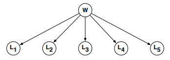

# Hangman

Consider the belief network shown below, where the random variable $W$ stores a five-letter word and the random variable $L_i \in \\{ {\tt A},{\tt B},\ldots,{\tt Z} \\}$ reveals only the word's $i^{th}$ letter. 

Also, suppose that these five-letter words are chosen at random from a large corpus of text according to their frequency:

$$P(W=w)\ =\ \frac{\mbox{COUNT}(w)}{\sum_{w'} \mbox{COUNT}(w')},$$

where COUNT $(w)$ denotes the number of times that $w$ appears in the corpus and where the denominator is a sum over all five-letter words. Note that in this model the conditional probability tables for the random variables $L_i$ are particularly simple:

$$
P(L_i = \ell|W = w)\ =\ \left\\{
\begin{array}{ll}
  1 & \mbox{if $\ell$ is the $i$th letter of $w$,} \\
  0 & \mbox{otherwise.}
\end{array}
\right.
$$

Now imagine a game in which you are asked to guess the word $w$ one letter at a time.  The rules of this game are as follows: after each letter (${\tt A}$ through ${\tt Z}$) that you guess, you'll be told whether the letter appears in the word and also where it appears.  Given the ${\it evidence}$ that you have at any stage in this game, the critical question is what letter to guess next.

Let's work on an example. Suppose that after three guesses --- the letters ${\tt D}, {\tt I}, {\tt M}$ --- you've learned that the letter ${\tt I}$ does ${\it not}$ appear, and that the letters ${\tt D}$ and ${\tt M}$ appear as follows:

$$\Large
{\underline{\hspace{1ex}{\tt M}\hspace{1ex}} 
\mbox{\hspace{1ex}} 
\underline{\mbox{\hspace{3ex}}}
\mbox{\hspace{1ex}} 
\underline{\hspace{1ex}{\tt D}\hspace{1ex}}
\mbox{\hspace{1ex}} 
\underline{\mbox{\hspace{3ex}}}
\mbox{\hspace{1ex}} 
\underline{\hspace{1ex}{\tt M}\hspace{1ex}}}
\normalsize$$

Now consider your next guess: call it $\ell$.  In this game the best guess is the letter $\ell$ that maximizes
$$P\Big(L_2=\ell\ \mbox{\bf or}\ L_4=\ell\ \Big|\ L_1={\tt M}, L_3={\tt D}, L_5= {\tt M}, L_2 \not \in \\{{\tt D},{\tt I},{\tt M}\\}, L_4 \not \in \\{{\tt D},{\tt I},{\tt M}\\}\Big).$$
In other works, pick the letter $\ell$ that is most likely to appear in the blank (unguessed) spaces of the word.  For any letter $\ell$ we can compute this probability as follows:

$$
\begin{eqnarray*}
\lefteqn{ P\Big(L_2=\ell\ \mbox{\bf or}\ L_4 = \ell\ \Big|\ L_1={\tt M}, L_3={\tt D}, L_5= {\tt M}, L_2 \not \in \\{{\tt D},{\tt I},{\tt M}\\}, L_4 \not \in \\{{\tt D},{\tt I},{\tt M}\\}\Big) } \\
 & = & \sum_w P\Big(W= w, L_2=\ell\ \mbox{\bf or}\ L_4=\ell\ \Big|\ L_1={\tt M}, L_3={\tt D}, L_5= {\tt M}, L_2 \not \in \\{{\tt D},{\tt I},{\tt M}\\}, L_4 \not \in \\{{\tt D},{\tt I},{\tt M}\\}\Big),\quad\fbox{\bf marginalization} \\
 & = & \sum_w P(W= w|L_1={\tt M}, L_3={\tt D}, L_5= {\tt M}, L_2 \not \in \\{{\tt D},{\tt I},{\tt M}\\}, L_4 \not \in \\{{\tt D},{\tt I},{\tt M}\\}\Big)\, P(L_2=\ell\ \mbox{\bf or}\ L_4=\ell|W=w)\ \fbox{\bf \small product rule and CI}
\end{eqnarray*}
$$

where in the third line we have exploited the conditional independence ({\bf CI}) of the letters $L_i$ given the word~$W$.  Inside this sum there are two terms, and they are both easy to compute.  In particular, the second term is more or less trivial:

$$P(L_2\!=\!\ell\ \mbox{\bf or}\ L_4\!=\!\ell|W\!=\!w)\
 =\ \left\{ \begin{array}{ll}
  1 & \mbox{if $\ell$ is the second or fourth letter of $w$} \\
  0 & \mbox{otherwise.}
\end{array} \right.$$
And the first term we obtain from Bayes rule:
\begin{eqnarray*}
\lefteqn{P(W\!=\! w|L_1\!=\!{\tt M}, L_3\!=\!{\tt D}, L_5\!=\! {\tt M}, L_2\!\not\in\!\{{\tt D},{\tt I},{\tt M}\}, L_4\!\not\in\!\{{\tt D},{\tt I},{\tt M}\}\Big)} \\ \\
  & = & \frac{P(L_1\!=\!{\tt M}, L_3\!=\!{\tt D}, L_5\!=\! {\tt M}, L_2\!\not\in\!\{{\tt D},{\tt I},{\tt M}\}, L_4\!\not\in\!\{{\tt D},{\tt I},{\tt M}\}|W\!=\! w\Big) P(W\!=\! w)}
{P(L_1\!=\!{\tt M}, L_3\!=\!{\tt D}, L_5\!=\! {\tt M}, L_2\!\not\in\!\{{\tt D},{\tt I},{\tt M}\}, L_4\!\not\in\!\{{\tt D},{\tt I},{\tt M}\})}\quad\fbox{\bf Bayes rule} \\
\end{eqnarray*}
In the numerator of Bayes rule are two terms; the left term is equal to zero or one (depending on whether the evidence is compatible with the word $w$), and the right term is the prior probability $P(W\!=\!w)$, as determined by the empirical word frequencies.  The denominator of Bayes rule is given by:
\begin{eqnarray*}
\lefteqn{P(L_1\!=\!{\tt M}, L_3\!=\!{\tt D}, L_5\!=\! {\tt M}, L_2\!\not\in\!\{{\tt D},{\tt I},{\tt M}\}, L_4\!\not\in\!\{{\tt D},{\tt I},{\tt M}\})}  \\
  & = & \sum_w P(W\!=\!w, L_1\!=\!{\tt M}, L_3\!=\!{\tt D}, L_5\!=\! {\tt M}, L_2\!\not\in\!\{{\tt D},{\tt I},{\tt M}\}, L_4\!\not\in\!\{{\tt D},{\tt I},{\tt M}\}),\quad\fbox{\bf marginalization} \\
  & = & \sum_w P(W\!=\!w) P(L_1\!=\!{\tt M}, L_3\!=\!{\tt D}, L_5\!=\! {\tt M}, L_2\!\not\in\!\{{\tt D},{\tt I},{\tt M}\}, L_4\!\not\in\!\{{\tt D},{\tt I},{\tt M}\}|W\!=\!w),\quad\fbox{\bf product rule}
 \end{eqnarray*}
where again all the right terms inside the sum are equal to zero or one.  Note that the denominator merely sums the empirical frequencies of words that are compatible with the observed evidence. 
 
Now let's consider the general problem.  Let $E$ denote the evidence at some intermediate round of the game: in general, some letters will have been guessed correctly and their places revealed in the word, while other letters will have been guessed incorrectly and thus revealed to be absent.  There are two essential computations.  The first is the {\it posterior} probability, obtained from Bayes rule:
$$P(W\!=\!w|E)\
  =\ \frac{P(E|W\!=\!w)\, P(W\!=\!w)}{\sum_{w'} P(E|W\!=\!w')\, P(W\!=\!w')}.$$
The second key computation is the {\it predictive} probability, based on the evidence, that the letter $\ell$ appears somewhere in the word:
$$P\Big(L_i\!=\! \ell\ \mbox{for some}\ i\!\in\!\{1,2,3,4,5\} \Big| E\Big)\
 =\  \sum_w P\Big(L_i\!=\! \ell\ \mbox{for some}\ i\!\in\!\{1,2,3,4,5\} \Big| W\!=\!w\Big) P\Big(W\!=\!w\Big|E\Big).$$
Note in particular how the first computation feeds into the second.  Your assignment in this problem is implement both of these calculations.  {\bf You may program in the language of your choice.}

% {\bf Turn in a printout of your source code along with answers to the following questions.}  Note that you may program in the language of your choice.
